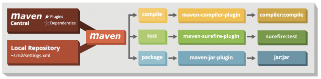

# build of one module using maven

# 1 - generate a new project using maven archetype
go to the directory where to generate new project and execute : 
`mvn archetype:generate -DarchetypeGroupId=org.apache.maven.archetypes -DarchetypeArtifactId=maven-archetype-quickstart -DarchetypeVersion=1.4`
see https://maven.apache.org/archetypes/maven-archetype-quickstart/

You can also use the integrated intellij feature.

# 2 - maven rather quickly

Maven is a project manager that can do **a lot** of things (some say too much for its own good ... and ours but those are hefty discussions for another time).
Its behavior is defined by a set of configuration files, the most important of which by far is the `pom.xml` (Project Object Model) at the root of the module.
The above schema provides a good overview of what it can handle for you : 

see https://www.jrebel.com/blog/maven-cheat-sheet

For performance purposes and so you don’t download the internet every time you invoke Maven commands, Maven caches everything that it downloads in a local repository. 
Think of it as a cache, if something is not yet in the local repository, but is required to execute a command, Maven checks the remote repositories.

The local repository typically resides in the ~/.m2 directory. This directory also stores the Maven configuration in the form of the settings.xml file. You can use it to configure the remote repositories, credentials to access them, and so on.

# 3 - maven commands

| Command  |                                                                      Description |     plugin     |
|----------|---------------------------------------------------------------------------------:|:--------------:|
| clean    |                                                          Delete target directory |                |
| validate |                                               Validate if the project is correct |                |
| test     |                                                                        Run tests |    surefire    |
| package  | Take the compiled code and package it in its distributable format, e.g. JAR, WAR | compiler & jar |
| verify   |     Run any checks to verify the MVN package is valid and meets quality criteria |                |
| install  |                                    Install the package into the local repository |                |
| deploy   |                            Copies the final MVN package to the remote repository |                |

# 4 - building and packaging 

Your current directory need to be the root of the maven module you want to build.

Then we can let maven handle the build (which is now targeted to /target of the module) and the packaging (which is now targeted to /target of the module) :
`mvn clean package`
this cleans (eg deletes the /target directory), and `package` builds and package the project.

Notice in the pom the lines : 
`<manifest>
<addClasspath>true</addClasspath>
<mainClass>quickstartmaven.com.bts.App</mainClass>
</manifest>`
Those replace the manifest files, in fact maven-jar-plugin writes a manifest from it and puts it in the jar.

Notice also how the version `<version>1.0-SNAPSHOT</version>` suffixes the name of the created jar.

Now you can test running this jar with : `java -jar target/3-quickstart-maven-1.0-SNAPSHOT.jar`

# 5 - Using profiles
see https://maven.apache.org/guides/introduction/introduction-to-profiles.html

According to need we want to package our module using App2 as entrypoint instead of App.
We can do that by using a profile that will use App2 as entrypoint. see the end of the pom.xml file.

Then we can build and package the project using the profile app2 : `mvn clean package -Papp2`

The test run now displays : `Hello World 2!`

